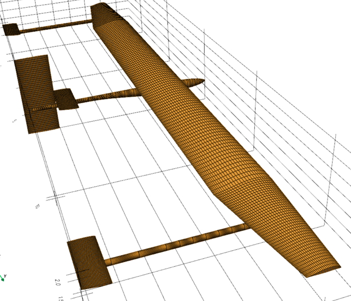
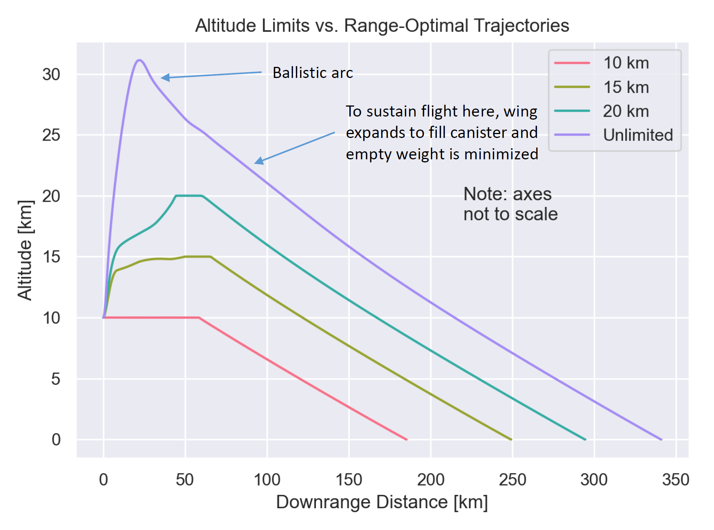
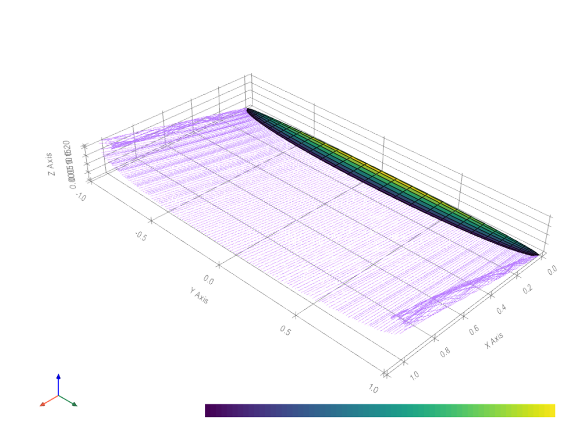
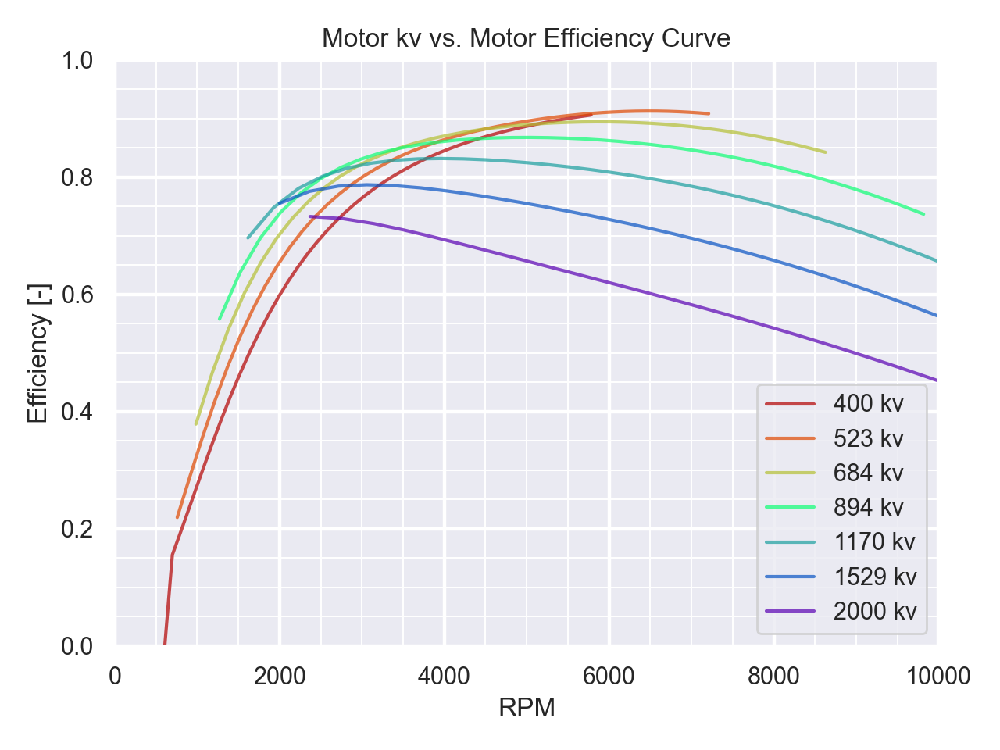
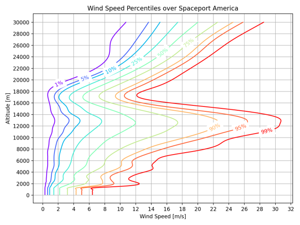
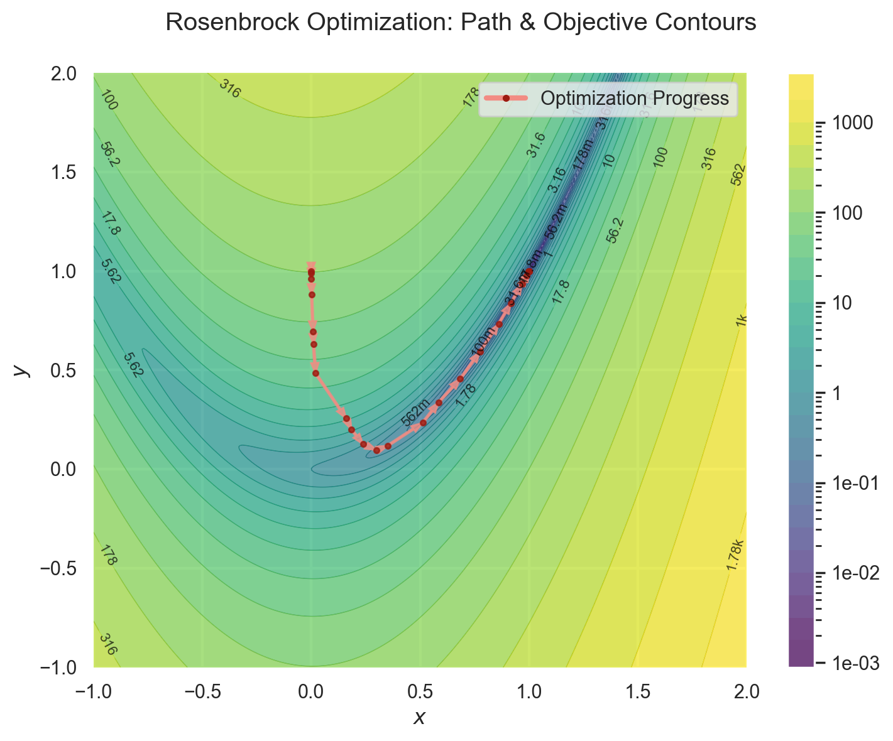
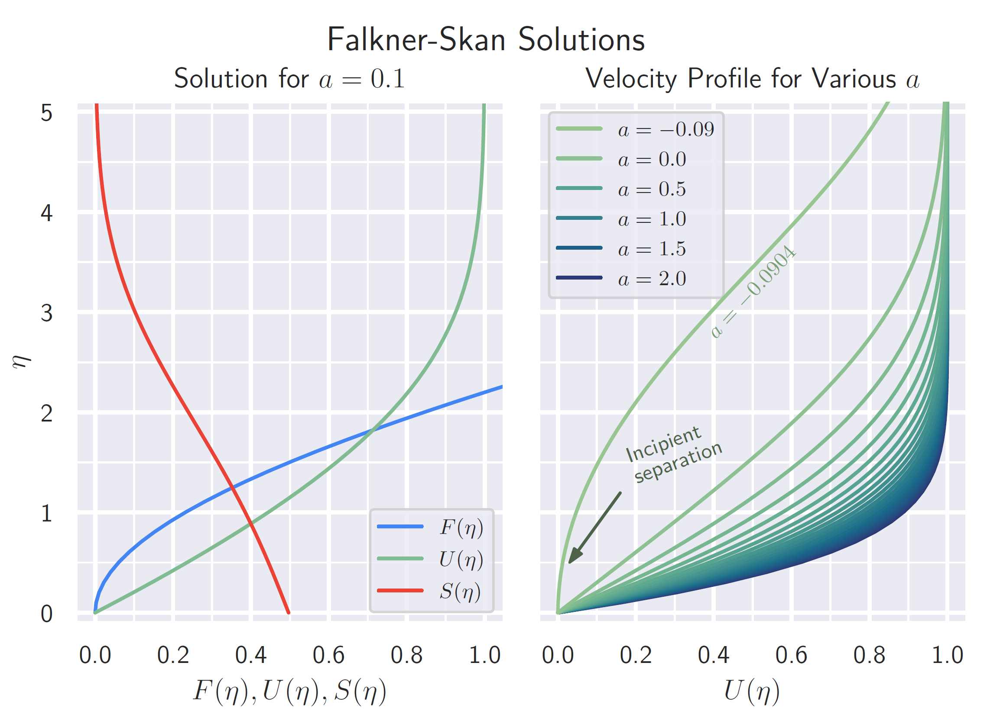

# [AeroSandbox](https://peterdsharpe.github.io/AeroSandbox/) :airplane:

by [Peter Sharpe](https://peterdsharpe.github.io) (<pds [at] mit [dot] edu>)

[](https://pepy.tech/project/aerosandbox)
[](https://pepy.tech/project/aerosandbox)
[](https://github.com/peterdsharpe/AeroSandbox/actions/workflows/run-pytest.yml)
[](https://pypi.python.org/pypi/aerosandbox)
[](https://aerosandbox.readthedocs.io/en/master/?badge=master)
[](https://opensource.org/licenses/MIT)

**AeroSandbox is a Python package that helps you design and optimize aircraft and other engineered systems.**

At its heart, AeroSandbox is an optimization suite that combines the ease-of-use of [familiar NumPy syntax](aerosandbox/numpy) with the power of [modern automatic differentiation](./tutorial/10%20-%20Miscellaneous/03%20-%20Resources%20on%20Automatic%20Differentiation.md).

This automatic differentiation dramatically improves optimization performance on large problems: **design problems with tens of thousands of decision variables solve in seconds on a laptop**. AeroSandbox also comes with dozens of end-to-end-differentiable aerospace physics models, allowing you to **simultaneously optimize an aircraft's aerodynamics, structures, propulsion, mission trajectory, stability, and more.** 

Keeping AeroSandbox easy to learn and use is a top priority. *Complexity is optional* - you can use AeroSandbox's built-in physics models where helpful, or you can drop in arbitrary custom physics models of your own.

```
pip install aerosandbox[full]
```

-----

### What can I do with AeroSandbox?

Use AeroSandbox to design and optimize entire aircraft:

<table>
    <tr>
        <td width="50%" valign="top">
            <p align="center">
                <a href="https://github.com/peterdsharpe/Feather-RC-Glider"><i>Feather</i> (an ultra-lightweight 1-meter-class RC motor glider)</a>
            </p>
            
        </td>
        <td width="50%" valign="top">
            <p align="center">
                <a href="https://github.com/peterdsharpe/solar-seaplane-preliminary-sizing"><i>SEAWAY-Mini</i> (a solar-electric, 13' wingspan seaplane)</a>
            </p>
            
        </td>
    </tr>
</table>

Use AeroSandbox to support real-world aircraft development programs, all the way from your very first sketch to your first-flight and beyond:

<table>
    <tr>
        <td width="50%" valign="top">
            <p align="center">
                <a href="https://github.com/peterdsharpe/DawnDesignTool">Initial concept sketches + sizing of <i>Dawn</i> (a solar-electric airplane for climate science research) in AeroSandbox, Spring 2020</a>
            </p>
            
        </td>
        <td width="50%" valign="top">
            <p align="center">
                <a href="https://youtu.be/CyTzx9UCvyo"><i>Dawn</i> (later renamed <i>SACOS</i>) in first flight, Fall 2022</a>
            </p>
            <p align="center"><a href="https://www.electra.aero/news/sacos-first-flight">(A massive build effort with excellent engineering and coordination by Electra.aero!)</a></p>
            
        </td>
    </tr>
</table>

Use AeroSandbox to explore counterintuitive, complicated design tradeoffs, all at the earliest stages of conceptual design *where these insights make the most difference*:

<table>
	<tr>
		<td width="33%" valign="top">
			<p align="center">
				<a href="https://github.com/peterdsharpe/DawnDesignTool">Exploring how big a solar airplane needs to be to fly, as a function of seasonality and latitude</a>
			</p>
			
		</td>
		<td width="33%" valign="top">
			<p align="center">
				<a href="https://www.popularmechanics.com/military/aviation/a13938789/mit-developing-mach-08-rocket-drone-for-the-air-force/">Exploring how the mission range of <i>Firefly</i>, a Mach 0.8 rocket drone, changes if we add an altitude limit, simultaneously optimizing aircraft design and trajectories</a>
			</p>
			
		</td>
		<td width="33%" valign="top">
			<p align="center">
				<a href="https://github.com/peterdsharpe/transport-aircraft">Exploring how many LH2 aircraft classes an airline fleet needs to cover the market, considering off-design performance</a>
			</p>
			
		</td>
	</tr>
</table>

Use AeroSandbox as a pure aerodynamics toolkit:

<table>
	<tr>
		<td width="50%" valign="top">
			<p align="center">
				VLM simulation of a glider, aileron deflections of +-30°
			</p>
			
		</td>
		<td width="50%" valign="top">
			<p align="center">
				Aerodynamic shape optimization of a wing planform, using an arbitrary objective and constraints
			</p>
			
		</td>
	</tr>
</table>

Among many other discplines:

<table>
	<tr>
		<td width="50%" valign="top">
			<p align="center">
				Structural optimization of a composite tube spar
			</p>
			
		</td>
		<td width="50%" valign="top">
			<p align="center">
				Electric motor analysis for propeller matching
			</p>
			
		</td>
	</tr>
	<tr>
		<td>
			<p align="center" valign="top">
				<a href="https://github.com/peterdsharpe/transport-aircraft">Tools to analyze unconventional propulsion (e.g., LH2)</a>
			</p>
			
		</td>
		<td>
			<p align="center" valign="top">
				Detailed weights estimation for aircraft ranging from micro-UAVs to airliners
			</p>
			
		</td>
</tr>
</table>

Easily interface AeroSandbox with all your favorite tools:

<table>
    <tr>
        <td width="33%" valign="top">
            <p align="center">
                Other conceptual design tools (AVL, XFLR5, XFoil, ASWING, MSES, etc.)
            </p>
            
        </td> 
          <td width="33%" valign="top">
                <p align="center">
                    CAD tools via STEP export (SolidWorks, Fusion 360, etc.)
                </p>
				<p align="center">
				(STL, OBJ, etc. supported too)
				</p>
                
            </td>
          <td width="33%" valign="top">
			<p align="center">
				User-provided models + code (for custom aerodynamics, structures, propulsion, or anything else - e.g., for optimizing flight through a probabilistic wind field, shown below) 
			</p>
			
		</td>
	</tr>
</table>

Or, throw all the airplane-design-specific code out entirely, and use AeroSandbox purely as an optimization solver or as a solver for nonlinear systems of equations (or ODEs, or PDEs):

<table>
	<tr>
		<td width="50%" valign="top">
			<p align="center">
				<a href="https://github.com/peterdsharpe/AeroSandbox/blob/develop/tutorial/01%20-%20Optimization%20and%20Math/01%20-%202D%20Rosenbrock.ipynb">Optimize the 2D Rosenbrock function</a>
			</p>
			
		</td>
		<td width="50%" valign="top">
			<p align="center">
				<a href="https://github.com/peterdsharpe/AeroSandbox/tree/develop/tutorial/03%20-%20Trajectory%20Optimization%20and%20Optimal%20Control/01%20-%20Solving%20ODEs%20with%20AeroSandbox">Specify the Falkner Skan ODE (nonlinear, 3rd-order BVP) and let AeroSandbox automatically take care of the discretization, solution, and even inverse solving.</a>
			</p>
			
		</td>
</tr>
</table>

And much, much more. Best of all, combine these tools arbitrarily without any loss in optimization speed and without any tedious derivative math, all thanks to AeroSandbox's end-to-end automatic-differentiability.

## Getting Started

### Installation

In short:

* `pip install aerosandbox[full]` for a complete install.

* `pip install aerosandbox` for a lightweight (headless) installation with minimal dependencies. All optimization, numerics, and physics models are included, but optional visualization dependencies are skipped.

For more installation details (e.g., if you're new to Python), [see here](./INSTALLATION.md).

### Tutorials, Examples, and Documentation

To get started, [check out the tutorials folder here](./tutorial/)! All tutorials are viewable in-browser, or you can open them as Jupyter notebooks by cloning this repository.

For a more detailed and theory-heavy introduction to AeroSandbox, [please see this thesis](./tutorial/sharpe-pds-sm-AeroAstro-2021-thesis.pdf).

For a yet-more-detailed developer-level description of AeroSandbox modules, [please see the developer README](aerosandbox/README.md).

For fully-detailed API documentation, see [the documentation website](https://aerosandbox.readthedocs.io/en/master/).

You can print documentation and examples for any AeroSandbox object by using the built-in `help()` function (e.g., `help(asb.Airplane)`). AeroSandbox code is also documented *extensively* in the source and contains hundreds of unit test examples, so examining the source code can also be useful.

### Usage Details

One final point to note: **all inputs and outputs to AeroSandbox are expressed in base SI units, or derived units thereof** (e.g., m, N, kg, m/s, J, Pa) - "an elegant unit system, for a more civilized age".

The only exception to this rule is when units are explicitly noted via variable name suffix. For example:

* `battery_capacity` -> Joules
* `battery_capacity_watt_hours` -> Watt-hours.

All angles are in radians, except for α and β which are in degrees due to long-standing aerospace convention. (In any case, units are marked on all function docstrings.)

If you wish to use other units, consider using [`aerosandbox.tools.units`](./aerosandbox/tools/units.py) to convert easily.

## Project Details

### Contributing

Please feel free to join the development of AeroSandbox - contributions are always so welcome! If you have a change you'd like to make, the easiest way to do that is by submitting a pull request.

The text file [`CONTRIBUTING.md`](./CONTRIBUTING.md) has more details for developers and power users.

If you've already made several additions and would like to be involved in a more long-term capacity, please message me!
Contact information can be found next to my name near the top of this README.

### Donating

If you like this software, please consider donating to support development [via PayPal](https://paypal.me/peterdsharpe)
or [GitHub Sponsors](https://github.com/sponsors/peterdsharpe/)! Proceeds will go towards more coffee for the grad students.

### Bugs

Please, please report all bugs by [creating a new issue](https://github.com/peterdsharpe/AeroSandbox/issues)!

### Versioning

AeroSandbox loosely uses [semantic versioning](https://semver.org/), which should give you an idea of whether or not you can probably expect backward-compatibility and/or new features from any given update.

For more details, see the [changelog](./CHANGELOG.md).

### Citation & Commercial Use

If you find AeroSandbox useful in a research publication, please cite it using the following BibTeX snippet:

```bibtex
@mastersthesis{aerosandbox,
    title = {AeroSandbox: A Differentiable Framework for Aircraft Design Optimization},
    author = {Sharpe, Peter D.},
    school = {Massachusetts Institute of Technology},
    year = {2021}
}
```

As the MIT License applies, use AeroSandbox for anything you want; attribution is strongly appreciated.

Commercial users: I'm more than happy to discuss consulting work for active AeroSandbox support if this package proves helpful - use the email address in the header of this README to get in touch.

### License

[MIT License, terms here](LICENSE.txt). Basically: use AeroSandbox for anything you want; no warranty express or implied.

## Stargazers over time

[](https://starchart.cc/peterdsharpe/AeroSandbox) 
