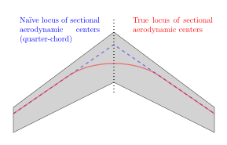

# Improving Workbook-Style Aerodynamics on Highly-Swept Wings

Peter Sharpe

-----

## Theory

### Mechanism and Problem Description

For a given cross-section (i.e., a slice normal to the local span) of the wing, we can define a sectional aerodynamic center. This aerodynamic center is the reference point at which the following relation holds:

$\frac{d(C_M)}{d \alpha} \bigg\rvert_{\alpha = \alpha_{\rm local}} = 0$

noting that $C_M$ changes depending on reference point, and with a few additional assumptions about freezing the 3D spanwise flow.

A naïve approach would place this sectional aerodynamic center at the location found in 2D aerodynamics analysis. (For a thin, uncambered airfoil at small angle of attack, this would be the quarter-chord $x/c=0.25$. A typical thicker cambered airfoil might have this at $x/c=0.30$ or so.) In the figure above, this would give a locus of aerodynamic centers corresponding to the blue line.

This is a relatively accurate approach for wings with low sweep angle.

However, for wings that are moderately- or highly-swept, this approach has significant error. This is because in reality, the locus of aerodynamic centers unsweeps near the centerline due to the symmetry boundary condition. (The same thing happens at a fuselage-wing intersection, as this also essentially represents a zero-penetration boundary condition for any inviscid flow.) This is illustrated by the red line in the figure above.

### Effects on Analysis Accuracy

If a workbook-style analysis does not include this unsweep effect, the net result is that the aerodynamic center of swept wings will be estimated to be too far forward. Thus, vehicle configurations with swept wings will appear to be less statically stable than they really are, tempting the designer to over-size stabilizer surfaces to account for the reduced stability. This yields unnecessary drag and performance limitation.

## The Fix

To fix it, we calibrate the un-corrected AeroBuildup (from ASB v3.5.12) against a vortex lattice method analysis, which accurately models this unsweep effect. We compute the magnitude of this effect for a generated database of several thousand synthetic airplanes varying in sweep, taper, scale, and aspect ratio (see `get_data.py`). We use symbolic regression to generate parsimonious models for this effect (see `make_fits_pysr.py`). Then, we plot them with `plot_fits_pysr.py`.