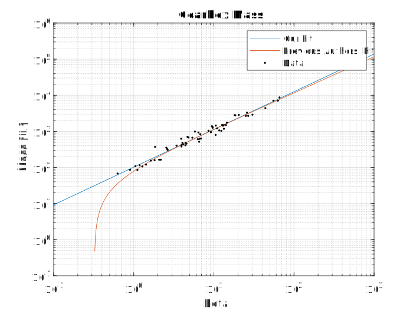
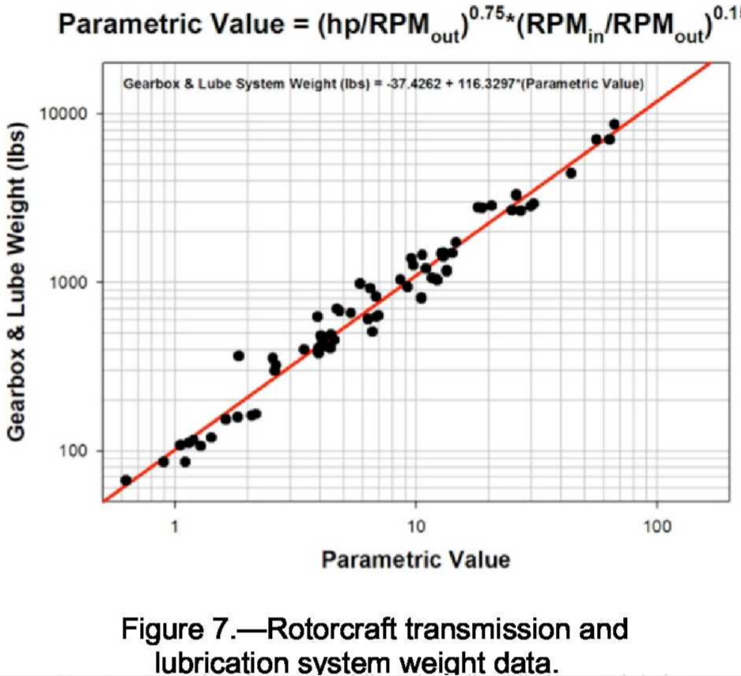

# GearboxMassFits
By Peter Sharpe

## Overview

Refitting data from a NASA technical report.

It baffles me that the original authors took data that's a straight line on a log-log plot and fit it to a linear equation instead of a power law - that's not how logarithms work at all!

This distinction doesn't particularly matter if you're using the equation within their data range, but if you extrapolate the authors' model even slightly beyond the data range, you start to predict negative gearbox mass.

Our fit:


Authors' original fit:


Data from NASATM—2009-215680.

## TL;DR: The Model

The following model is found, where `x = log10(Re)`:

The model:

Matlab-ish syntax:
```matlab
log10(CD) = 
(log10(10^(csub0*x+csub1)+csub2+csub3*x))*(1-1/(1+exp(-csigh*(x-csigc)))) + (csup0+csupscl/csuph*log(exp(csuph*(csupc-x))+1))*(1/(1+exp(-csigh*(x-csigc))))
```

Python-ish syntax:
```python
log10(CD) = 
(log10(10 ** (csub0*x+csub1)+csub2+csub3*x))*(1-1/(1+exp(-csigh*(x-csigc)))) + (csup0+csupscl/csuph*log(exp(csuph*(csupc-x))+1))*(1/(1+exp(-csigh*(x-csigc))))
```
Constants:
```
csigc = 5.5766722118597247
csigh = 23.7460859935990563
csub0 = -0.6989492360435040
csub1 = 1.0465189382830078
csub2 = 0.7044228755898569
csub3 = 0.0846501115443938
csup0 = -0.0823564417206403
csupc = 6.8020230357616764
csuph = 9.9999999999999787
csupscl = -0.4570690347113859
```
