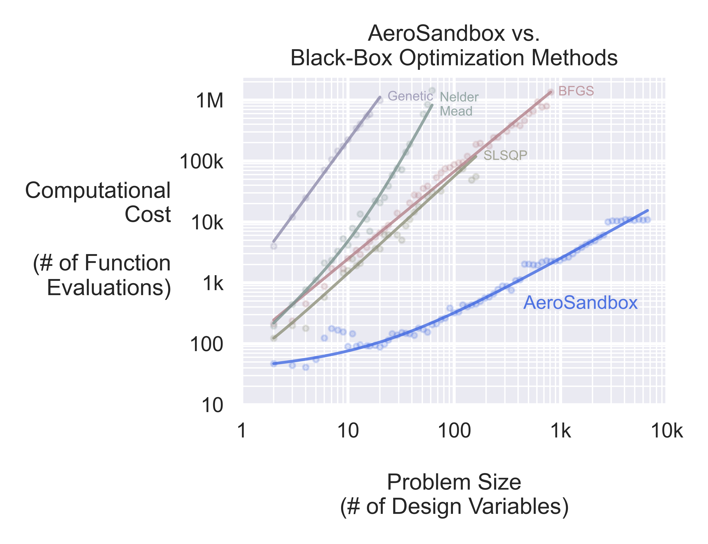
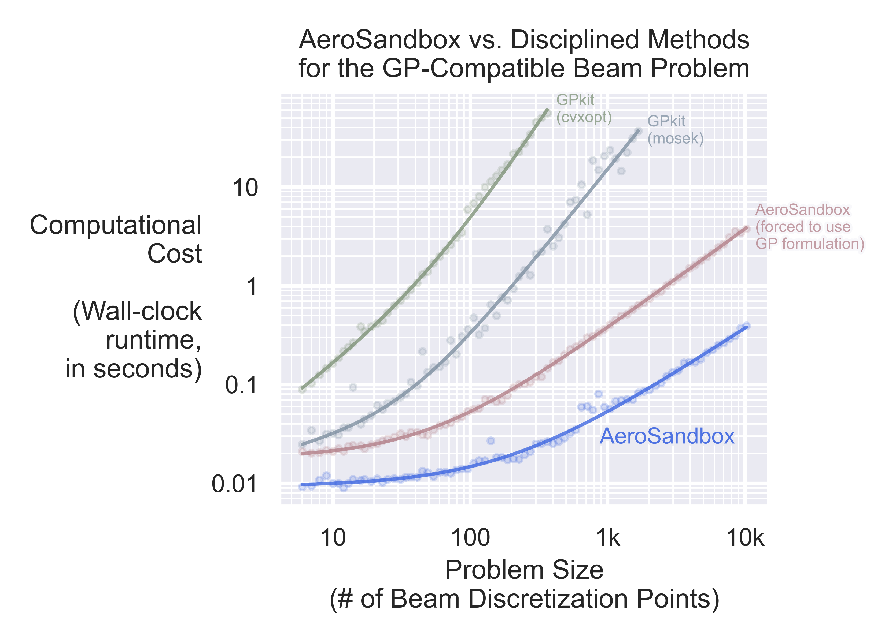

# Optimization Benchmark Problems

This folder compares optimization performance with AeroSandbox to various other common optimization paradigms.

## AeroSandbox vs. Black-Box Optimization Methods

This chart shows optimization performance on the [N-dimensional Rosenbrock problem](https://en.wikipedia.org/wiki/Rosenbrock_function#Multidimensional_generalizations). Here, $N$ is the number of design variables, which is a convenient knob to dial up or down the difficulty of the problem. The problem is defined as:

* minimize $\sum\limits_{i=1}^{N-1} [ 100(x_{i+1} - x_i^2)^2 + (1 - x_i)^2]$

For all $N$, the global optimum is at $\vec{x} = \vec{1}$, where the objective function evaluates to $0$. 

This problem is chosen here because it shares many difficult aspects with engineering design optimization problems: it is nonlinear, nonconvex, and poorly-scaled. Furthermore, **we deliberately choose awful initial guesses**, with each element of the vector of initial guesses drawn from a random uniform distribution in the interval $[-10, 10]$.

The performance of AeroSandbox (with CasADi backend) is compared against existing methods using black-box optimization techniques. AeroSandbox offers faster practical and asymptotic optimization performance than existing black-box optimization methods, demonstrating the magnitude of acceleration that is possible.

Exact code implementation of each method is [here](./nd_rosenbrock/run_times.py).

## AeroSandbox vs. Disciplined Optimization Methods

Here, we compare the performance of AeroSandbox (with CasADi backend) to existing methods using disciplined optimization techniques. AeroSandbox offers faster practical and asymptotic optimization performance than existing disciplined optimization methods, demonstrating the magnitude of acceleration that is possible.

One disciplined optimization method used in aircraft design is geometric programming, with the [GPkit](https://github.com/convexengineering/gpkit) package an example implementation of this. Here, we compare the performance of AeroSandbox to GPkit on the GP-compatible [beam problem](https://gpkit.readthedocs.io/en/latest/examples.html#simple-beam) given in the GPkit documentation. 

This problem is a structural analysis of a cantilever beam with a distributed load. As described in the GPkit documentation:

> In this example we consider a beam subjected to a uniformly distributed transverse force along its length. The beam has fixed geometry so we are not optimizing its shape, rather we are simply solving a discretization of the Euler-Bernoulli beam bending equations using GP.

In this chart, runtime is used instead of function evaluations, because the GPkit API doesn't easily expose this information from the underlying solver.

Exact code implementation of each method is [here](./gp_beam/run_times.py).

